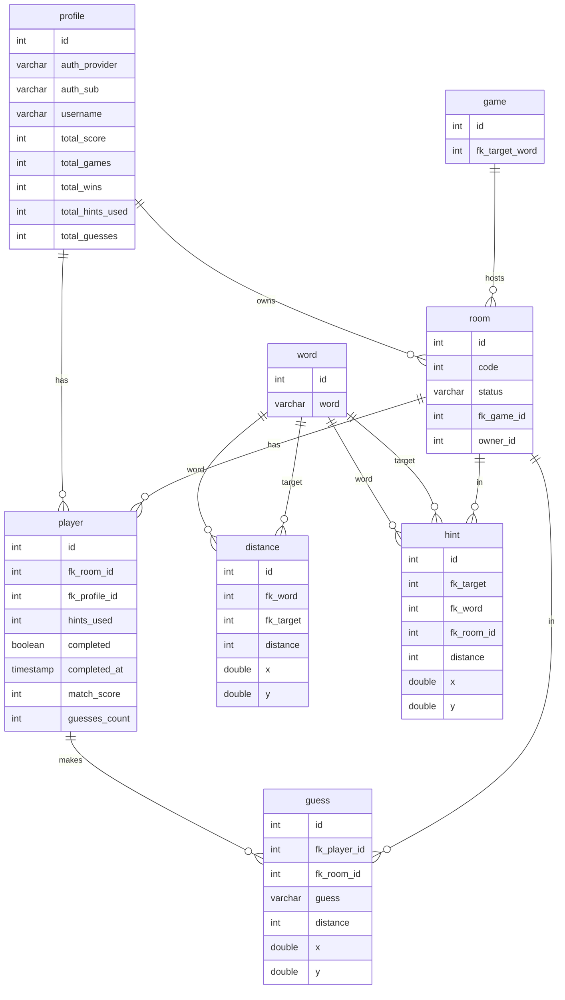

```bash
verbalyst_db=#
\d public.profile
\d public.room
\d public.game
\d public.player
\d public.word
\d public.distance
\d public.hint
\d public.guess
```

```bash
Table "public.profile"
Column         |       Type        | Collation | Nullable |             Default              
----------------+-------------------+-----------+----------+----------------------------------
 id             | integer           |           | not null | nextval('profile_id_seq'::regclass)
 auth_provider  | character varying |           | not null | 
 auth_sub       | character varying |           | not null | 
 username       | character varying |           | not null | 
 total_score    | integer           |           | not null | 
 total_games    | integer           |           | not null | 
 total_wins     | integer           |           | not null | 
 total_hints_used | integer         |           | not null | 
 total_guesses  | integer           |           | not null | 
Indexes:
    "profile_pkey" PRIMARY KEY, btree (id)
    "ix_profile_auth_sub" UNIQUE, btree (auth_sub)


Table "public.room"
 Column      |       Type        | Collation | Nullable |             Default               
-------------+-------------------+-----------+----------+-----------------------------------
 id          | integer           |           | not null | nextval('room_id_seq'::regclass)
 code        | integer           |           | not null | 
 status      | character varying |           | not null | 
 fk_game_id  | integer           |           | not null | 
 owner_id    | integer           |           | not null | 
Indexes:
    "room_pkey" PRIMARY KEY, btree (id)
    "ix_room_code" UNIQUE, btree (code)
Foreign-key constraints:
    "room_fk_game_id_fkey" FOREIGN KEY (fk_game_id) REFERENCES game(id)
    "room_owner_id_fkey" FOREIGN KEY (owner_id) REFERENCES profile(id)


Table "public.game"
 Column            |       Type        | Collation | Nullable |             Default              
-------------------+-------------------+-----------+----------+----------------------------------
 id                | integer           |           | not null | nextval('game_id_seq'::regclass)
 fk_target_word    | integer           |           | not null | 
Indexes:
    "game_pkey" PRIMARY KEY, btree (id)
Foreign-key constraints:
    "game_fk_target_word_fkey" FOREIGN KEY (fk_target_word) REFERENCES word(id)


Table "public.player"
 Column           |            Type             | Collation | Nullable |             Default                
------------------+-----------------------------+-----------+----------+------------------------------------
 id               | integer                     |           | not null | nextval('player_id_seq'::regclass)
 fk_room_id       | integer                     |           | not null | 
 fk_profile_id    | integer                     |           | not null | 
 hints_used       | integer                     |           | not null | 
 completed        | boolean                     |           | not null | 
 completed_at     | timestamp without time zone |           |          | 
 match_score      | integer                     |           | not null | 
 guesses_count    | integer                     |           | not null | 
Indexes:
    "player_pkey" PRIMARY KEY, btree (id)
Foreign-key constraints:
    "player_fk_room_id_fkey" FOREIGN KEY (fk_room_id) REFERENCES room(id)
    "player_fk_profile_id_fkey" FOREIGN KEY (fk_profile_id) REFERENCES profile(id)


Table "public.word"
 Column |       Type        | Collation | Nullable |             Default              
--------+-------------------+-----------+----------+----------------------------------
 id     | integer           |           | not null | nextval('word_id_seq'::regclass)
 word   | character varying |           | not null | 
Indexes:
    "word_pkey" PRIMARY KEY, btree (id)
    "ix_word_word" UNIQUE, btree (word)


Table "public.distance"
 Column      |  Type    | Collation | Nullable |             Default              
-------------+----------+-----------+----------+-----------------------------------
 id          | integer  |           | not null | nextval('distance_id_seq'::regclass)
 fk_word     | integer  |           | not null | 
 fk_target   | integer  |           | not null | 
 distance    | integer  |           | not null | 
 x           | double precision  |    |          | 
 y           | double precision  |    |          | 
Indexes:
    "distance_pkey" PRIMARY KEY, btree (id)
Foreign-key constraints:
    "distance_fk_word_fkey" FOREIGN KEY (fk_word) REFERENCES word(id)
    "distance_fk_target_fkey" FOREIGN KEY (fk_target) REFERENCES word(id)


Table "public.hint"
 Column      |  Type    | Collation | Nullable |             Default              
-------------+----------+-----------+----------+-----------------------------------
 id          | integer           |           | not null | nextval('hint_id_seq'::regclass)
 fk_target   | integer           |           | not null | 
 fk_word     | integer           |           | not null | 
 fk_room_id  | integer           |           |          | 
 distance    | integer           |           | not null | 
 x           | double precision  |           |          | 
 y           | double precision  |           |          | 
Indexes:
    "hint_pkey" PRIMARY KEY, btree (id)
Foreign-key constraints:
    "hint_fk_target_fkey" FOREIGN KEY (fk_target) REFERENCES word(id)
    "hint_fk_word_fkey" FOREIGN KEY (fk_word) REFERENCES word(id)
    "hint_fk_room_id_fkey" FOREIGN KEY (fk_room_id) REFERENCES room(id)


Table "public.guess"
 Column      |       Type        | Collation | Nullable |             Default               
-------------+-------------------+-----------+----------+-----------------------------------
 id           | integer           |           | not null | nextval('guess_id_seq'::regclass)
 fk_player_id | integer           |           | not null | 
 fk_room_id   | integer           |           |          | 
 guess        | character varying |           | not null | 
 distance     | integer           |           | not null | 
 x            | double precision  |           |          | 
 y            | double precision  |           |          | 
Indexes:
    "guess_pkey" PRIMARY KEY, btree (id)
Foreign-key constraints:
    "guess_fk_player_id_fkey" FOREIGN KEY (fk_player_id) REFERENCES player(id)
    "guess_fk_room_id_fkey" FOREIGN KEY (fk_room_id) REFERENCES room(id)


```
