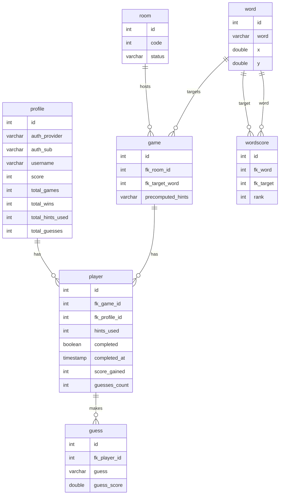

```bash
verbalyst_db=# 
\d public.game
\d public.guess
\d public.player
\d public.profile
\d public.room
\d public.word
\d public.wordscore
                                       Table "public.game"
      Column       |       Type        | Collation | Nullable |             Default              
-------------------+-------------------+-----------+----------+----------------------------------
 id                | integer           |           | not null | nextval('game_id_seq'::regclass)
 fk_room_id        | integer           |           |          | 
 fk_target_word    | integer           |           | not null | 
 precomputed_hints | character varying |           |          | 
Indexes:
    "game_pkey" PRIMARY KEY, btree (id)
Foreign-key constraints:
    "game_fk_room_id_fkey" FOREIGN KEY (fk_room_id) REFERENCES room(id)
    "game_fk_target_word_fkey" FOREIGN KEY (fk_target_word) REFERENCES word(id)
Referenced by:
    TABLE "player" CONSTRAINT "player_fk_game_id_fkey" FOREIGN KEY (fk_game_id) REFERENCES game(id)

                                    Table "public.guess"
    Column    |       Type        | Collation | Nullable |              Default              
--------------+-------------------+-----------+----------+-----------------------------------
 id           | integer           |           | not null | nextval('guess_id_seq'::regclass)
 fk_player_id | integer           |           | not null | 
 guess        | character varying |           | not null | 
 guess_score  | double precision  |           | not null | 
Indexes:
    "guess_pkey" PRIMARY KEY, btree (id)
Foreign-key constraints:
    "guess_fk_player_id_fkey" FOREIGN KEY (fk_player_id) REFERENCES player(id)

                                          Table "public.player"
    Column     |            Type             | Collation | Nullable |              Default               
---------------+-----------------------------+-----------+----------+------------------------------------
 id            | integer                     |           | not null | nextval('player_id_seq'::regclass)
 fk_game_id    | integer                     |           | not null | 
 fk_profile_id | integer                     |           | not null | 
 hints_used    | integer                     |           | not null | 
 completed     | boolean                     |           | not null | 
 completed_at  | timestamp without time zone |           |          | 
 score_gained  | integer                     |           | not null | 
 guesses_count | integer                     |           | not null | 
Indexes:
    "player_pkey" PRIMARY KEY, btree (id)
Foreign-key constraints:
    "player_fk_game_id_fkey" FOREIGN KEY (fk_game_id) REFERENCES game(id)
    "player_fk_profile_id_fkey" FOREIGN KEY (fk_profile_id) REFERENCES profile(id)
Referenced by:
    TABLE "guess" CONSTRAINT "guess_fk_player_id_fkey" FOREIGN KEY (fk_player_id) REFERENCES player(id)

                                      Table "public.profile"
      Column      |       Type        | Collation | Nullable |               Default               
------------------+-------------------+-----------+----------+-------------------------------------
 id               | integer           |           | not null | nextval('profile_id_seq'::regclass)
 auth_provider    | character varying |           | not null | 
 auth_sub         | character varying |           | not null | 
 username         | character varying |           | not null | 
 score            | integer           |           | not null | 
 total_games      | integer           |           | not null | 
 total_wins       | integer           |           | not null | 
 total_hints_used | integer           |           | not null | 
 total_guesses    | integer           |           | not null | 
Indexes:
    "profile_pkey" PRIMARY KEY, btree (id)
    "ix_profile_auth_sub" UNIQUE, btree (auth_sub)
Referenced by:
    TABLE "player" CONSTRAINT "player_fk_profile_id_fkey" FOREIGN KEY (fk_profile_id) REFERENCES profile(id)

                                 Table "public.room"
 Column |       Type        | Collation | Nullable |             Default              
--------+-------------------+-----------+----------+----------------------------------
 id     | integer           |           | not null | nextval('room_id_seq'::regclass)
 code   | integer           |           | not null | 
 status | character varying |           | not null | 
Indexes:
    "room_pkey" PRIMARY KEY, btree (id)
    "ix_room_code" UNIQUE, btree (code)
Referenced by:
    TABLE "game" CONSTRAINT "game_fk_room_id_fkey" FOREIGN KEY (fk_room_id) REFERENCES room(id)

                                 Table "public.word"
 Column |       Type        | Collation | Nullable |             Default              
--------+-------------------+-----------+----------+----------------------------------
 id     | integer           |           | not null | nextval('word_id_seq'::regclass)
 word   | character varying |           | not null | 
 x      | double precision  |           |          | 
 y      | double precision  |           |          | 
Indexes:
    "word_pkey" PRIMARY KEY, btree (id)
    "ix_word_word" UNIQUE, btree (word)
Referenced by:
    TABLE "game" CONSTRAINT "game_fk_target_word_fkey" FOREIGN KEY (fk_target_word) REFERENCES word(id)
    TABLE "wordscore" CONSTRAINT "wordscore_fk_target_fkey" FOREIGN KEY (fk_target) REFERENCES word(id)
    TABLE "wordscore" CONSTRAINT "wordscore_fk_word_fkey" FOREIGN KEY (fk_word) REFERENCES word(id)

                              Table "public.wordscore"
  Column   |  Type   | Collation | Nullable |                Default                
-----------+---------+-----------+----------+---------------------------------------
 id        | integer |           | not null | nextval('wordscore_id_seq'::regclass)
 fk_word   | integer |           | not null | 
 fk_target | integer |           | not null | 
 rank      | integer |           | not null | 
Indexes:
    "wordscore_pkey" PRIMARY KEY, btree (id)
Foreign-key constraints:
    "wordscore_fk_target_fkey" FOREIGN KEY (fk_target) REFERENCES word(id)
    "wordscore_fk_word_fkey" FOREIGN KEY (fk_word) REFERENCES word(id)

```
