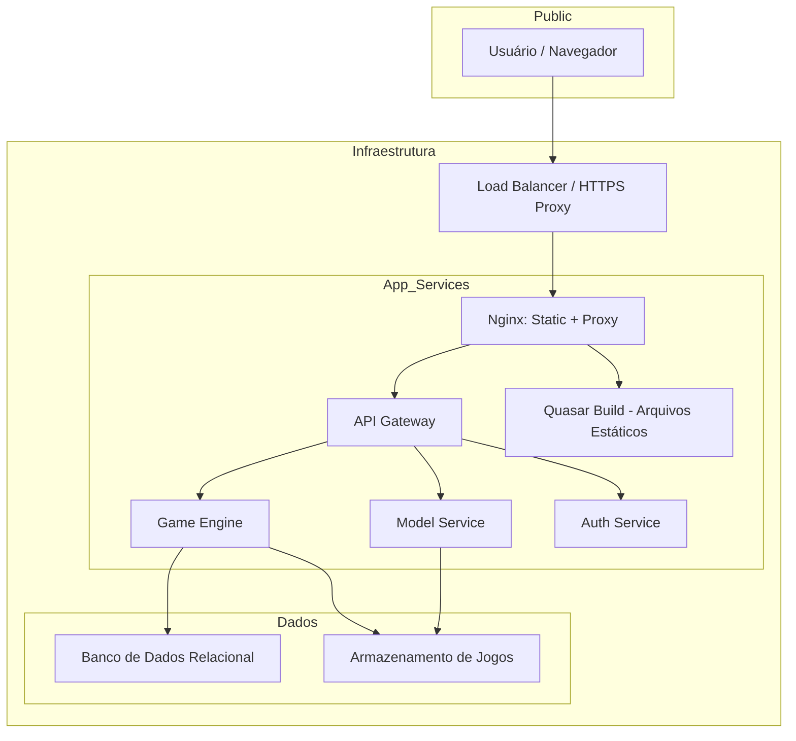

# Verbalyst

## Modelo Semântico

O sistema de similaridade do Verbalyst utiliza vetores pré-treinados da língua portuguesa para representar palavras e calcular distâncias semânticas entre tentativas e a palavra-alvo.

### Base do Modelo

Os embeddings utilizados foram extraídos do repositório de modelos do [NILC](http://nilc.icmc.usp.br/nilc/index.php/repositorio-de-word-embeddings-do-nilc) que disponibiliza diversos vetores treinados com algoritmos como Word2Vec, FastText, Wang2Vec e GloVe.

Após benchmarks preliminares, optou-se pelo modelo **Word2Vec Skip-Gram com 100 dimensões**, por oferecer boa performance com custo computacional reduzido. O modelo é carregado com `gensim.KeyedVectors`.

### Redução e Filtragem do Vocabulário

O vocabulário original do modelo contém mais de 900.000 palavras, sendo impraticável para uso direto em um jogo. Foi realizada uma filtragem com base em listas públicas de vocabulário do português brasileiro, como a disponibilizada pelo projeto [br.ispell (IME-USP)](https://www.ime.usp.br/~pf/dicios/), visando remover:

- Palavras com acentos gráficos ou cedilha.
- Termos com símbolos ou caracteres especiais.
- Entradas muito raras ou ruidosas.
- Palavras duplicadas geradas pela normalização.

Essa filtragem serve como uma primeira etapa. Outras listas e critérios poderão ser utilizados posteriormente para refinar o conjunto. O objetivo é convergir para um vocabulário útil de cerca de **20.000 palavras**.

### Normalização

Todas as palavras passam por uma padronização:

- Convertidas para minúsculas.
- Acentos, cedilhas e caracteres especiais são removidos.

Exemplos:
- `"avô"` e `"avó"` tornam-se `"avo"`.
- `"coração"` torna-se `"coracao"`.

Essa escolha visa melhorar a performance e facilitar a entrada do jogador, ainda que implique em pequenas perdas semânticas. A equivalência entre flexões (plural, gênero) poderá futuramente ser tratada com agrupamento leve ou lematização simplificada.

### Formatos Utilizados

O modelo semântico é manipulado e armazenado em diferentes formatos ao longo do pipeline:

- `.txt`: formato original dos embeddings.
- `.kv`: formato binário via Gensim para uso no backend.
- `.json`: versões reduzidas ou intermediárias para testes e benchmarks.
- `.bin`: versões otimizadas para carregamento em memória.

### Pipeline de Pré-processamento

1. Carregamento do modelo `.txt` original.
2. Filtragem cruzada com listas externas de vocabulário.
3. Normalização de tokens.
4. Exportação para `.kv` e `.json` para uso no backend e testes.
5. Execução de benchmarks internos com pares semânticos.
6. Validação da cobertura do vocabulário alvo do jogo.

### Estratégias Futuras

- Aplicação de lematização leve para unificação de formas plurais e flexões de gênero.
- Criação de grupos semânticos e categorias automáticas.
- Geração automática de dicas com base em clustering ou KNN.
- Cache de distâncias para palavras de alta frequência.
- Avaliação de modelos contextualizados para futuras funcionalidades.

## Game Design

### Modos de Jogo

#### Solo
- Experiência individual.
- Jogador resolve uma palavra do dia específica.
- Pode jogar dailies passadas.
- Não requer autenticação.
- Persistência local (por exemplo, localStorage).
- Cada partida é independente.

#### Room
- Modo colaborativo síncrono para múltiplos jogadores.
- Todos os jogadores resolvem a mesma palavra do dia, em tempo real.
- Dicas e tentativas são compartilhadas.
- Requer autenticação.
- Cada sala tem uma palavra do dia associada.
- Pode incluir chat, nomes visíveis e sincronização de estado.
  
### Componentes Centrais

#### Modelo Semântico
- Embedding pré-processado (Word2Vec) com vocabulário filtrado (~20.000 palavras).
- Base para cálculo de similaridade entre palavras.
- Responsável por fornecer:
  - Distância semântica entre tentativas e a palavra-alvo.
  - Sugestões de dicas com base na proximidade semântica.

#### Gerador de Jogos
- Seleciona a palavra-alvo do dia.
- Calcula e armazena distâncias entre a palavra-alvo e todas as palavras do vocabulário.
- Gera uma lista fixa de dicas relevantes.
- Prepara metadados estáticos da partida antes do jogo começar.
   
### Estrutura de Partida

Uma sessão de jogo é definida como a interação de um jogador (ou grupo, no caso de uma room) com uma palavra-alvo específica.

#### Dados Estáticos de uma Partida
- `target_word`: a palavra a ser descoberta.
- `word_distances`: dicionário ou lista de palavras do vocabulário com suas respectivas distâncias em relação à palavra-alvo.
- `precomputed_hints`: lista de hints gerada pelo sistema.

#### Estado da Partida
- `guesses`: lista de palavras já tentadas.
- `guess_scores`: lista de pontuações associadas às tentativas.
- `hints_used`: quantidade ou índice das dicas utilizadas.
- `completed`: booleano indicando se a palavra foi descoberta.
- `completed_at`: timestamp de finalização.

### Pontuação

- A pontuação de uma partida é calculada com base em múltiplos fatores:
  - Número de tentativas até descobrir a palavra.
  - Uso de dicas (penalidade proporcional).
  - Proximidade média das tentativas com a palavra-alvo.

### Persistência

#### Partidas Solo
- Armazenadas localmente no navegador.
- Não associadas a um usuário.
- Dados podem incluir progresso parcial, histórico de tentativas, pontuação e timestamp.

#### Partidas Autenticadas
- Associadas a um jogador identificado.
- Persistidas em um sistema remoto.
- Permite recuperação posterior, leaderboard e histórico.

### Jogador

- Entidade opcional (usuário anônimo ou autenticado).
- Pode possuir:
  - Identificador único.
  - Histórico de partidas.
  - Estatísticas agregadas (pontuação média, taxa de acerto, etc.).

### Sala
- Instância multiplayer temporária.
- Possui:
  - `room_id`: identificador único.
  - `host_id`: jogador que criou a sala.
  - `game_reference`: link para a palavra do dia sendo jogada.
  - `players`: lista de jogadores participantes.
  - `shared_guesses`: tentativas feitas, visíveis a todos.
  - `shared_hints`: dicas já utilizadas pelo grupo.
  - `status`: ativo, encerrado, etc.

### Extensões Futuras

- Suporte a rankings públicos baseados em jogos do dia.
- Modo desafio entre jogadores (um define uma palavra para o(s) outro(s)).
- Sistema de progressão com conquistas.
- Geração de jogos com base em domínios específicos.

## Arquitetura

A arquitetura técnica do Verbalyst é modular e escalável, estruturada em serviços especializados para facilitar manutenção, performance e futuras expansões.

### Frontend (UI)
- Desenvolvido com Quasar (Vue 3 + Vite).
- Aplicativo single-page com comunicação via HTTP/REST com o backend.
- Responsável pela interação com o jogador, exibição de tentativas, dicas, pontuação e estado da partida.
- Persistência local via `localStorage` para partidas solo.

### API Gateway
- Intermediário entre o frontend e os serviços internos.
- Responsável por autenticação de tokens, roteamento, CORS, e padronização das respostas.
- Expõe endpoints organizados por domínio: `/auth`, `/game`, `/model`.

### Auth Service
- Serviço opcional para autenticação via OAuth (Google, GitHub).
- Gera tokens JWT e gerencia identidades de jogadores autenticados.
- Permite partidas persistidas e participação em salas multiplayer.

### Game Engine
- Serviço central de lógica de jogo.
- Responsável por:
  - Iniciar partidas solo ou multiplayer.
  - Registrar tentativas e calcular pontuação.
  - Enviar dicas.
  - Validar conclusão de partidas.
  - Sincronizar estado de salas.
- Armazena partidas autênticas em banco de dados.

### Model Service
- Carrega o modelo de embeddings filtrado (~20.000 palavras).
- Exposto como serviço independente para:
  - Cálculo de similaridade entre duas palavras.
  - Geração de dicas com base na palavra-alvo.
  - Retorno de distâncias do vocabulário completo (para o gerador de jogos).
- Otimizado para manter o modelo em memória (Gensim `.kv`).

### Gerador de Jogos
- Função acoplada à Game Engine ou ao Model Service.
- Executa diariamente ou sob demanda.
- Seleciona uma `target_word`, calcula distâncias e salva metadados estáticos do jogo:
  - `word_distances`
  - `precomputed_hints`
- Gera arquivos `.json` organizados por ID incremental (`1.json`, `2.json`, ...).

### Banco de Dados
- Usado para persistência de partidas autenticadas e salas.
- Estrutura básica:
  - `players(id, name, auth_provider)`
  - `games(id, player_id, target_word, completed_at, score)`
  - `guesses(id, game_id, word, score, timestamp)`
  - `rooms(id, host_id, target_word, status)`
  - `room_guesses(id, room_id, player_id, word, score, timestamp)`

### Armazenamento Estático
- Diretório com os arquivos gerados do jogo do dia.
- Cada jogo é armazenado como um `.json` com dados estáticos:
  - Palavra-alvo.
  - Distâncias pré-calculadas.
  - Lista de dicas.
- Facilita leitura rápida e cache.

