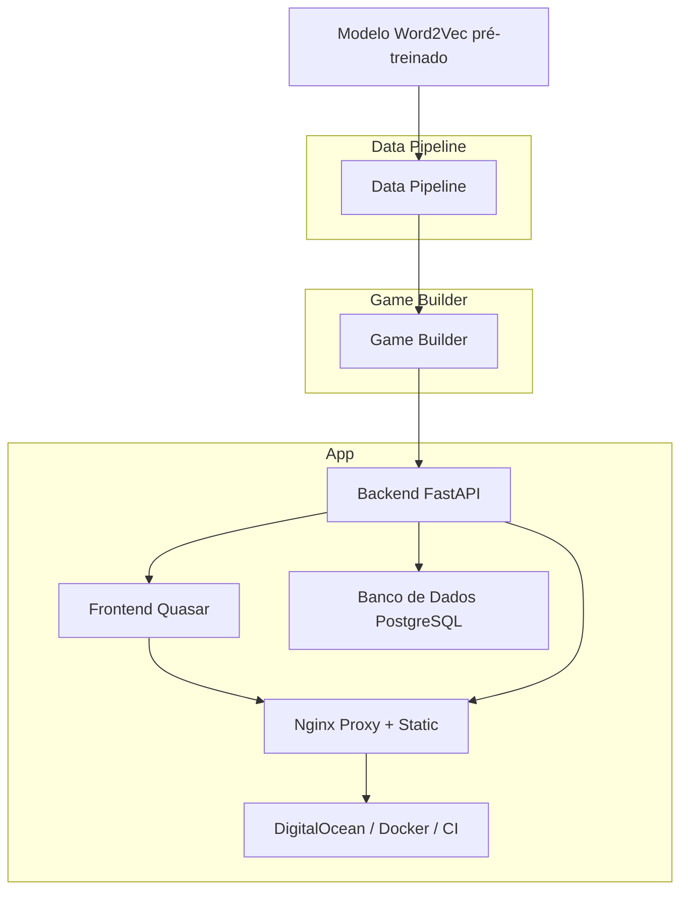

# Verbalyst

O Verbalyst é um jogo de similaridade semântica em português. Inspirado em Contexto/Semantle, desafia o jogador a descobrir uma palavra secreta com base em proximidade semântica calculada a partir de embeddings vetoriais.

## Overview

A arquitetura é dividida em três etapas principais, conectadas por arquivos intermediários e interfaces bem definidas:

### 1. Data Pipeline

Processa um modelo Word2Vec pré-treinado, aplicando filtragens, normalizações e validações para gerar um modelo reduzido em .kv, otimizado para uso em produção.

### 2. Game Builder

Utiliza o modelo filtrado para gerar jogos completos em .json, contendo a palavra-alvo, dicas pré-calculadas e coordenadas vetoriais bidimensionais.

### 3. App

Composta por backend (FastAPI), frontend (Quasar) e banco de dados (PostgreSQL). Tudo é servido por Nginx, containerizado com Docker e publicado via GitHub Actions na DigitalOcean.

### Diagrama de Arquitetura


## Data Pipeline

[→ Análise exploratória: `/.docs/word2vec_final_analysis.ipynb`](./.docs/word2vec_final_analysis.ipynb)

A pipeline prepara um modelo Word2Vec reduzido e limpo para uso no jogo, a partir de uma versão pré-treinada disponibilizada pelo [NILC](http://nilc.icmc.usp.br/nilc/index.php/repositorio-de-word-embeddings-do-nilc). 

Foi selecionado o modelo **Word2Vec Skip-Gram com 100 dimensões**, por balancear desempenho e custo computacional. A versão original é carregada no formato `.txt` e convertida para `.kv` com o Gensim.


### Etapas

1. **Extração de palavras frequentes**
   - Entrada: arquivo de frequência (`lemas.totalbr.freq.txt`)
   - Saída: top 10.000 palavras com no mínimo 2 letras
   - Formato: apenas palavras (1 por linha), extraídas a partir do campo de lemas

2. **Filtragem cruzada com dicionário léxico**
   - Entrada: dicionário léxico (`br-utf8.txt`)
   - Mantém apenas palavras que também existam no dicionário léxico

3. **Normalização**
   - Remoção de acentos, cedilhas e conversão para minúsculas
   - Remove duplicatas após a normalização

4. **Filtragem cruzada com dicionário normalizado**
   - Entrada: `br-sa.txt` (dicionário sem acentos)
   - Mantém apenas palavras encontradas também no dicionário sem acentos

5. **Filtragem do modelo Word2Vec**
   - Carrega modelo `.txt` original (`word2vec_skip_100.txt`)
   - Aplica a mesma normalização nas palavras do modelo
   - Filtra o modelo mantendo apenas as palavras normalizadas restantes
   - Remove duplicatas
   - Saída: modelo final salvo como `.kv` (`word2vec_filtered.kv`)

6. **Log e verificações**
   - Log de todas as etapas é impresso no terminal
   - Arquivo final contém apenas palavras com representação vetorial no modelo

### Estrutura
```plaintext	
data_pipeline/
├── main.py # script principal
├── config.py # caminhos e constantes
├── frequency.py # extração da lista de palavras frequentes
├── filters.py # intersecções com dicionários
├── normalize.py # regras de normalização
├── model_utils.py # carregamento e filtragem do modelo Word2Vec
├── io_utils.py # log e escrita auxiliar
```
### Entradas

- `word2vec_skip_100.txt` (modelo original)
- `lemas_totalbr_freq.txt` (frequência de lemas)
- `br-utf8.txt`, `br-sa.txt` (dicionários auxiliares)

### Saídas

- `word2vec_final.kv` (modelo final filtrado)
- `logs/filtered_words.txt` (log das palavras mantidas)

### Resultado Atual

8021 palavras

### Execução

```bash
python data_pipeline/src/main.py
```
### Referências:
- [Model](http://nilc.icmc.usp.br/nilc/index.php/repositorio-de-word-embeddings-do-nilc) 
- [Lema Frequency](https://www.linguateca.pt/acesso/ordenador.php)
- [Dicionarios](https://www.ime.usp.br/~pf/dicios/)
- Hartmann, N. S. et al. (2017). *Portuguese Word Embeddings: Evaluating on Word Analogies and Natural Language Tasks*. [arXiv:1708.06025](https://arxiv.org/abs/1708.06025).   Disponível localmente em [`/.docs/1708.06025v1.pdf`](./.docs/1708.06025v1.pdf)

## Game Builder
