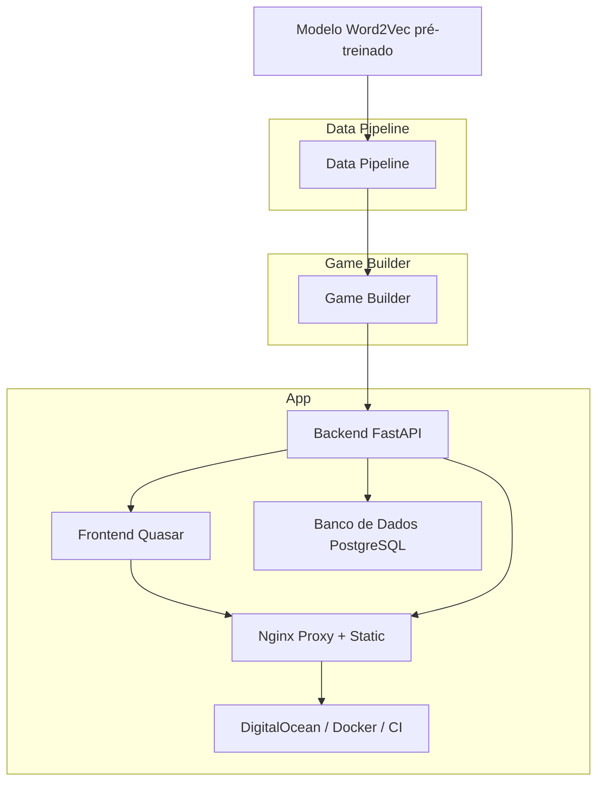
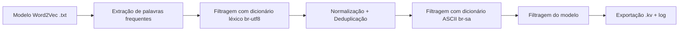
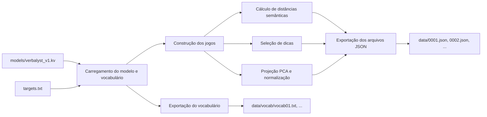

# Verbalyst

O Verbalyst é um jogo de similaridade semântica em português. Inspirado em Contexto/Semantle, desafia o jogador a descobrir uma palavra secreta com base em proximidade semântica calculada a partir de embeddings vetoriais.

## Overview

A arquitetura é dividida em três etapas principais, conectadas por arquivos intermediários e interfaces bem definidas:

### 1. Data Pipeline

Processa um modelo Word2Vec pré-treinado, aplicando filtragens, normalizações e validações para gerar um modelo reduzido em .kv, otimizado para uso em produção.

### 2. Game Builder

Utiliza o modelo filtrado para gerar jogos completos em .json, contendo a palavra-alvo, dicas pré-calculadas e coordenadas vetoriais bidimensionais.

### 3. App

Composta por backend (FastAPI), frontend (Quasar) e banco de dados (PostgreSQL). Tudo é servido por Nginx, containerizado com Docker e publicado via GitHub Actions na DigitalOcean.

### Diagrama de Arquitetura


## Data Pipeline

[→ Análise exploratória: `/.docs/word2vec_final_analysis.ipynb`](./.docs/word2vec_final_analysis.ipynb)

A pipeline prepara um modelo Word2Vec reduzido e limpo para uso no jogo, a partir de uma versão pré-treinada disponibilizada pelo [NILC](http://nilc.icmc.usp.br/nilc/index.php/repositorio-de-word-embeddings-do-nilc). 

Foi selecionado o modelo **Word2Vec Skip-Gram com 100 dimensões**, por balancear desempenho e custo computacional. A versão original é carregada no formato `.txt` e convertida para `.kv` com o Gensim.


### Etapas

1. **Extração de palavras frequentes**
   - Entrada: `lemas_totalbr_freq.txt`
   - Seleciona as 10.000 palavras mais frequentes com ≥ 2 letras e apenas caracteres alfabéticos.
   - Converte para minúsculas e descarta o restante da linha.

2. **Filtragem com dicionário UTF-8**
   - Entrada: `br-utf8.txt`
   - Mantém apenas palavras presentes no dicionário léxico UTF-8 (com acentos).

3. **Normalização + remoção de duplicatas**
   - Remove acentos e sinais gráficos (`NFKD`).
   - Converte para minúsculas.
   - Elimina duplicatas com base na forma normalizada.

4. **Filtragem com dicionário ASCII**
   - Entrada: `br-sa.txt`
   - Mantém apenas palavras presentes na lista ASCII (sem acentos).

5. **Filtragem do modelo Word2Vec**
   - Entrada: `word2vec_skip_100.txt`
   - Carrega o modelo no formato texto.
   - Normaliza todas as palavras do modelo e filtra usando o vocabulário final.
   - Remove duplicatas no processo.
   - Saída: modelo reduzido salvo como `word2vec_final.kv`.

6. **Log**
   - Salva `logs/filtered_words.txt` com as palavras preservadas no modelo `.kv`.
  


### Estrutura
```plaintext	
data_pipeline/
├── main.py         # script principal
├── config.py       # caminhos e constantes
├── frequency.py    # extração da lista de palavras frequentes
├── filters.py      # intersecções com dicionários
├── normalize.py    # regras de normalização
├── model_utils.py  # carregamento e filtragem do modelo Word2Vec
├── io_utils.py     # log e escrita auxiliar
```
### Entradas

- `word2vec_skip_100.txt` (modelo original)
- `lemas_totalbr_freq.txt` (frequência de lemas)
- `br-utf8.txt`, `br-sa.txt` (dicionários auxiliares)

### Saídas

- `word2vec_final.kv` (modelo final filtrado)
- `logs/filtered_words.txt` (log das palavras mantidas)

### Resultado Atual

8021 palavras

### Execução

```bash
python data_pipeline/src/main.py
```

### Referências:
- [Model](http://nilc.icmc.usp.br/nilc/index.php/repositorio-de-word-embeddings-do-nilc) 
- [Lema Frequency](https://www.linguateca.pt/acesso/ordenador.php)
- [Dicionarios](https://www.ime.usp.br/~pf/dicios/)
- Hartmann, N. S. et al. (2017). *Portuguese Word Embeddings: Evaluating on Word Analogies and Natural Language Tasks*. [arXiv:1708.06025](https://arxiv.org/abs/1708.06025).   Disponível localmente em [`/.docs/1708.06025v1.pdf`](./.docs/1708.06025v1.pdf)

## Game Builder

O Game Builder é responsável por gerar os arquivos de jogo a partir do modelo semântico previamente filtrado. Cada jogo contém uma palavra-alvo, um conjunto de dicas e dados auxiliares (distância semântica e coordenadas 2D), exportados em formato `.json`.

### Etapas

1. **Carregamento**
   - O modelo `.kv` é carregado com `gensim`.
   - O vocabulário é extraído do próprio modelo.
   - As palavras-alvo são lidas de `targets.txt`.

2. **Construção dos Jogos**
   Para cada palavra-alvo:
   - Calcula-se a distância semântica entre a palavra-alvo e todas as demais.
   - Selecionam-se dicas entre as palavras mais próximas, com balanceamento por faixas.
   - As palavras são projetadas em duas dimensões com PCA, centralizando a palavra-alvo.
   - Distâncias são normalizadas e associadas a coordenadas.

3. **Exportação**
   - Cada jogo é salvo como `0001.json`, `0002.json`, etc.
   - O vocabulário usado é salvo em `data/vocab/`.



### Estrutura

```plaintext
game_builder/
├── main.py           # script principal
├── config.py         # parâmetros e caminhos
├── target.py         # carrega palavras-alvo
├── distance.py       # calcula distâncias semânticas
├── hint.py           # seleciona dicas
├── coordinates.py    # gera coordenadas 2D
├── export.py         # salva arquivos de jogo e vocabulário
```
### Entradas
- `models/verbalyst_v1.kv` (modelo filtrado)

- `targets.txt` (palavras-alvo)

### Saídas
- `data/0001.json`, `data/0002.json` ... (jogos)

- `data/vocab/vocab01.txt`, ... (vocabulário por execução)

### Execução
```bash
python game_builder/main.py
```

## App

